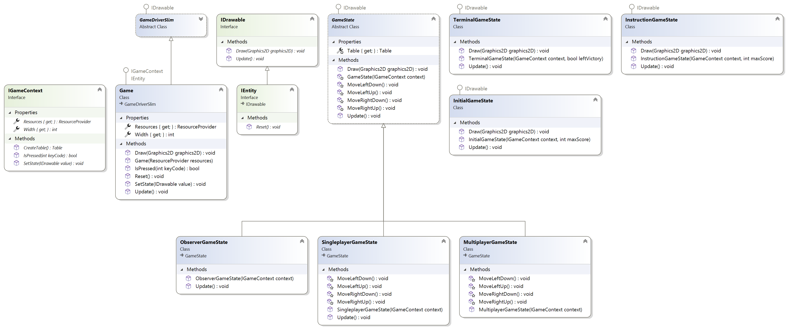
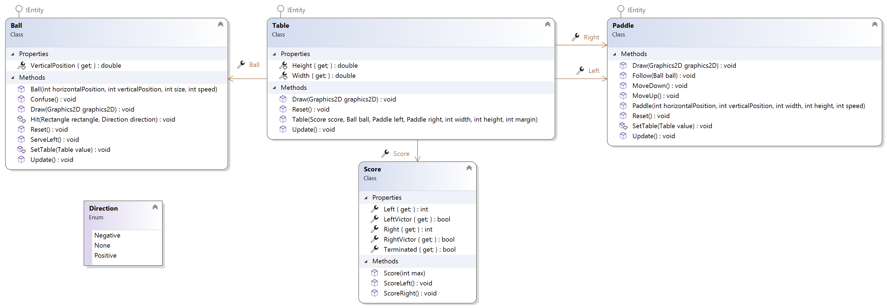
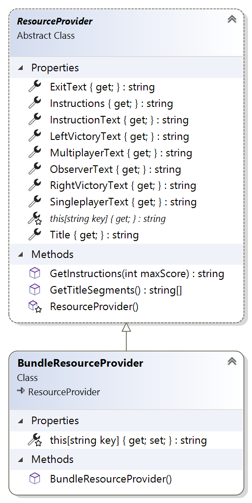
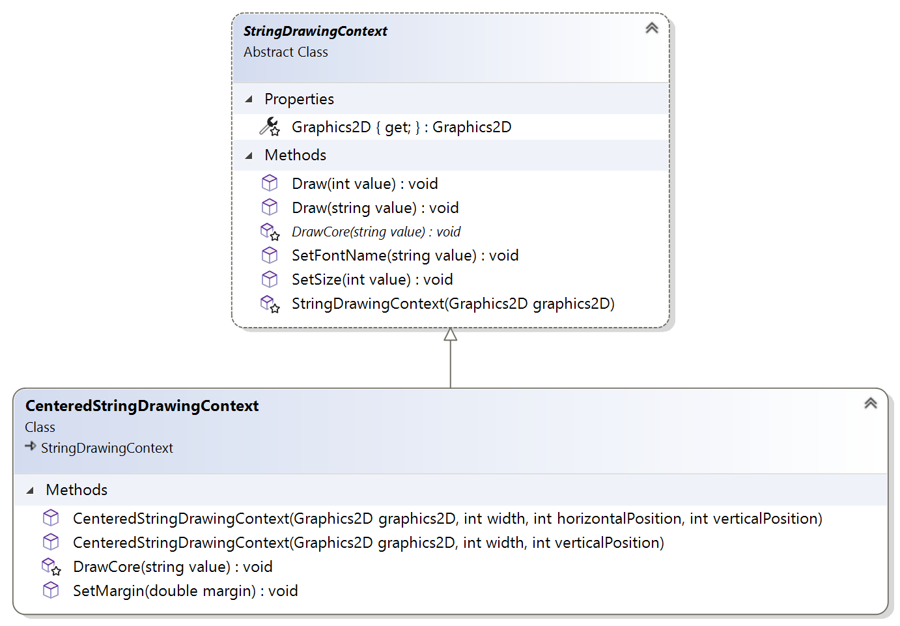

# Ishan Pranav\'s PONG
This is a Java implementation of PONG created by Ishan Pranav for the AP Computer Science A course and distributed under the MIT License.
## Class diagrams
### State pattern

### Object model

### Resource management

### Drawing

## License
This repository is licensed with the [MIT](LICENSE) license.
